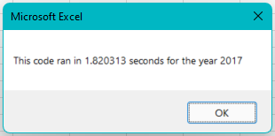

# Green Stocks Analysis
Used VBA for stocks analysis and refactored code.

## Table of contents
* [Overview of Project](#overview-of-project)
* [Results](#results)
* [Summary](#summary)

## Overview of Project
This analysis was for Steve, who had clients interested in green stocks. The clients were initially interested in "DQ" stocks, but after analysis the returns didn't look promising. Steve then requested I create buttons that allow him to quickly analyze all green stocks by year and to add a timer to the analysis. He then asked me to refactor the code so he could expand the dataset to analyze the whole stock market, not just the initial green stocks.

### Results
Run times for the refactored code were 10 times faster than the original code for the 2017 analysis.

Run times for the refactored code were 5 times faster than the original code for the 2018 analysis.

"RUN" and "ENPH" stocks are the only green stocks whose returns remained positive in 2017 and 2018.

## Summary
Advantages of refactoring
- Uses existing script
- Improved quality
- Faster run time
- More organized and easier to read

Disadvantages of refactoring
- Retesting functionality
- Strong understanding of VBA needed to improve efficiency
- Time consuming
- Existing code doesn't account for future dataset

For this project, refactoring the code wasn't necessary. Original run times were relatively fast for the existing dataset, a few seconds at most. However, Steve wants to expand the dataset to analyze the whole stock market. This refactored code *should* run faster for the larger dataset, but hasn't been tested for that future dataset and would need updates to the tickers array.
